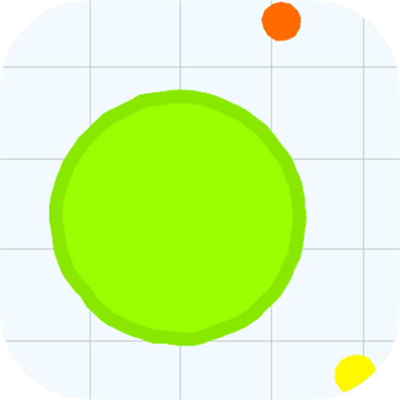

  
  

    
Akar.IO

    
An agar.io clone made in Java!

  

---

# Why
This project was made by me and one of my classmate as a mid-year test.

All the project is made out of bare Java swing and Graphics2D, without the use of external libraries.

# What we used
- **TCP Sockets**: for the client-server communications (this game can handle multiple clients connected to one server). *UDP would have been a better choice for speed but the assignment required to use TCP connections and we do our best to make a playable game...*
- **Java Swing/Graphics2D**: for the graphics, to draw shapes, text and images
- **GIT (GitHub)**: to collaborate and keep our code shared
- **Visual Studio Code (IDE)**: we used VSC as IDE with the Java extension to handle compilations and debugging steps

# How it works

## Server
The server handle all the different connections with the clients. It uses a TCP socket configured on the port **7373**.

All the different clients connections generates a thread that the server will handle simultaneosly.

The collisions between the client and the different entities are checked server-side, also the availabilty of usernames and the calculation of average ping per-packet.

By default the server and the clients communicate at aproximately 16/17 pps *(packets-per-second)*.

### **A server packet**
*We made a standard for our connections, with a basic packet that handle all the data that will be sent to the client from the server.*

| Property   | Type     | Description                                                                                 |
| ---------- | -------- | ------------------------------------------------------------------------------------------- |
| players    | Player[] | It has all the session players currently playing                                            |
| foods      | Food[]   | It has all the session foods that have been ate or not                                      |
| spikes     | Spike[]  | It has all the session spikes                                                               |
| canConnect | boolean  | It says to the client if it can connect or not                                              |
| avgPing    | String   | It is the average ping between the client packet timestamp and the current server timestamp |

## Client
Steps when launching the game:
1. Input the desidered server address in `IP:PORT` format
2. Choose an username and a color
3. Click the `Gioca` button to enter the play area managed by the server
4. When you die it will show you a new panel with your final score; you can either choose to go back home or to play again in the same server

The client will only render all the entities sent from the server.

The render is window-based, only the things that are present in the window frame will be rendered in the viewport to achieve better performance.

The client also manage a basic ranking-table generated from an array of all current server players.

### **A client packet**
*We made a standard for our connections, with a basic packet that handle all the data that will be sent to the server from the client.*

| Property  | Type       | Description                                                  |
| --------- | ---------- | ------------------------------------------------------------ |
| player    | Player     | It is the client playing player object                       |
| operation | StatusEnum | It is the status operation flag that the server will receive |
| time      | long       | It is the time when the packet it is generated               |

# License
Project source-code and compiled versions are freely available and licensed under the [GNU General Public License v3.0](LICENSE).